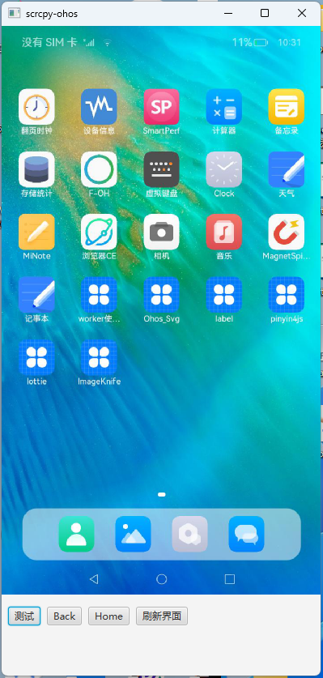

# scrcpy-ohos 鸿蒙设备投屏工具

本项目基于 JavaFx + Idea + Gradle + JDK11开发而成，使用中有什么问题，欢迎提 ISSUE 与 PR

参考 scrcpy(https://github.com/Genymobile/scrcpy) 制作而成

使用前需配置hdc环境变量，保证在cmd中能使用hdc shell命令

投屏工具兼容rk3568、华为matepad、华为openharmony系统版本手机

界面显示采用的截屏方案，所以并不是实时显示的，而是在执行点击操作后延时显示的，后期考虑加入实时显示功能

